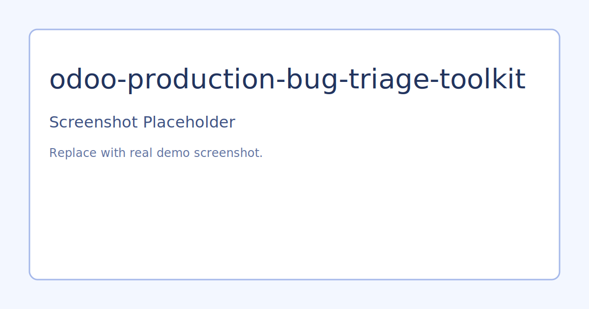

# Odoo Production Bug Triage Toolkit

## Problem
Production incidents in Odoo environments need fast triage, reliable documentation, and safe mitigations. Ad hoc incident handling leads to repeat outages.

## Solution
This project introduces a structured incident model and a practical SQL slow-log helper script.

## What It Demonstrates
- Incident lifecycle tracking with severity and status
- Support-friendly fields for root cause and mitigation notes
- Slow query scanning utility for PostgreSQL logs
- Playbook template for urgent blocker response

## Architecture
- `addons/ops_triage/models/incident_record.py`
- `scripts/scan_slow_log.ps1`
- `docs/incident_playbook.md`

## Demo Flow
1. Install addon and create example incidents.
2. Simulate support workflow from `open` to `resolved`.
3. Run `scripts/scan_slow_log.ps1 -LogPath <path>` on sample logs.
4. Apply playbook steps for SEV1 and SEV2 scenarios.

## Portfolio Talking Points
- How standard triage data improves post-incident analysis.
- Practical ways to reduce blocker resolution time.
- Safe hotfix workflow expectations for ERP systems.

## Screenshots

Replace ssets/screenshots/placeholder.svg with real screenshots from your Odoo demo environment.

